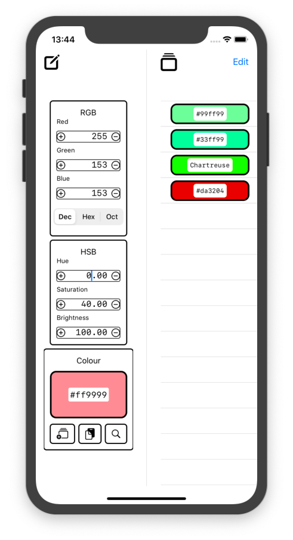
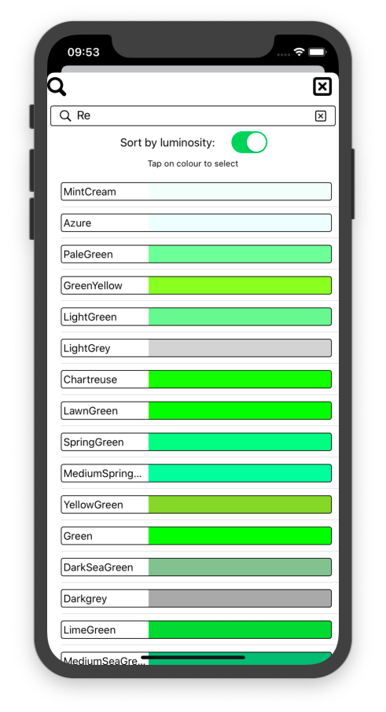

# ColourViewer
Test of SwiftUI and Combine

### Main Screen

The main screen is divided into two, the colour editor and the colour history list. The 3 sections of the editor are coupled together so that updating any value automatically updates the other two sections.

####  Editor Panel

####  History Panel

###  Colour Search Screen

The Colour Search Screen allows searching for colours by CSS name. The list is automatically updated once two characters have been entered and tapping on the name closes the screen and copies the colour into the editor.
