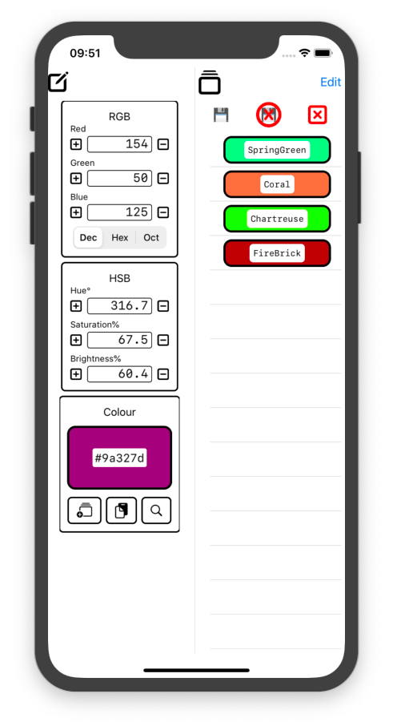
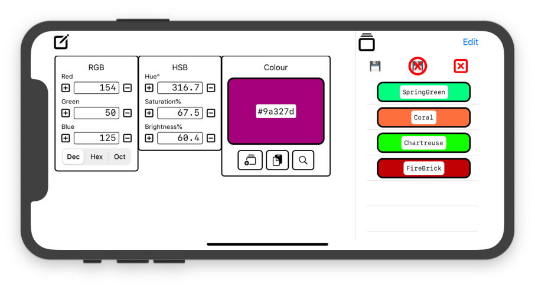

# ColourViewer
Test of SwiftUI and Combine

### Main Screen

The main screen is divided into two, the colour editor and the colour history list. The 3 sections of the editor are coupled together so that updating any value automatically updates the other two sections.

####  Editor Panel

The left hand panel is the editor. It has an RGB section, an HSB section and a colour section. Changing a value in the RGB section changes the HSB section as well and vice versa. Changes in either section also update the colour section. It in turn can be updated by the search panel or the history panel and in that case the RGB and HSB sections are also updated.

The colour section displays the colour and it's well known name if one exists. If it doesn't then the hexadecimal code is displayed

The colour section has 3 buttons:
*  Add the current colour to the history list.
*  Add the current colour to the clipboard.
*  Open the search panel.

####  History Panel

The history panel displays colours added to it using the  button. The list items can be moved or deleted if the Edit button at the top right is tapped.

Each item is itself a button and tapping it will update the editor.

###  Colour Search Screen

The Colour Search Screen allows searching for colours by CSS name. The list is automatically updated once two characters have been entered and tapping on the name closes the screen and copies the colour into the editor.

The large  button in the top right hand corner close the screen without doing anything.

The screen starts searching as soon as two characters have been entered into the textfield but a single character may be searched for by pressing enter or the little  button to the left of the text. The  button clears both the text field and the matched colours list.

The colours whose name conains the text in the search field are displayed below the text. The list is normally sorted by name but can be sorted by luminosity (ITU-R Rec. BT-709) which is a measure of the colours luminosity. Tapping on any name closes the sheet and copies that name into the editor.
